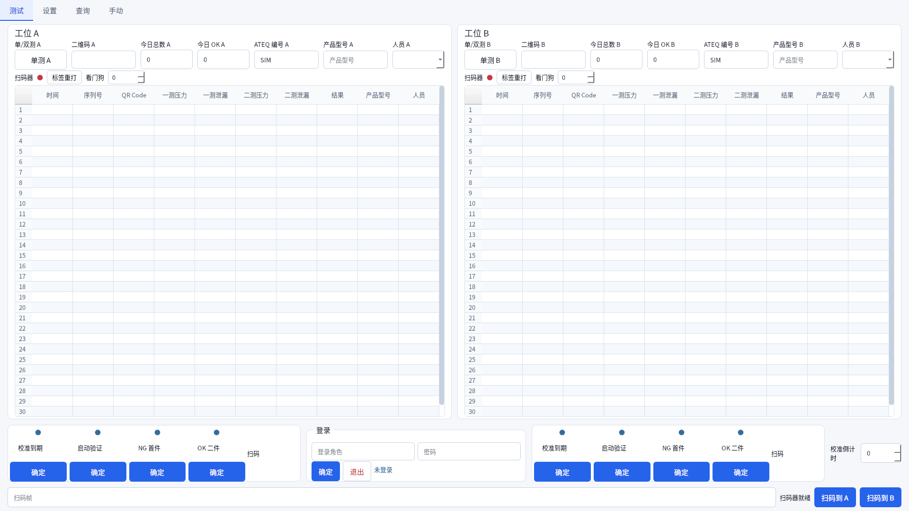

# 协众双工位双通道气密检测系统

> Morocco 2 Stations / Leak Test 2 Channels

本项目是一套面向生产线箱体气密检测的双工位控制软件，包含原始 LabVIEW 工程和正在完善的 Python 安全迁移候选版。系统按 A、B 两个独立工位组织，覆盖扫码、第一次气密测试、第二次气密测试、结果记录、标签打印、查询导出、设备设置、校准样件和手动控制等流程。

当前 Python 版本定位为 **SIMULATE / UI Demo 候选版**：离线模拟、界面、状态机、安全门禁和自动测试已经完成；真实 PLC、ATEQ、扫码器、MySQL、BarTender 尚未通过现场验收，因此 `characterization`、`shadow` 和 `live` 模式会主动阻断硬件写入。请勿将当前候选版直接用于生产控制。



## 项目目标

- 支持 A/B 双工位并行生产，并保持工位状态、测试结果和异常恢复彼此隔离。
- 实现“扫码 → 第一次测试 → 第二次测试 → OK 贴标 / NG 结束”的完整可追溯流程。
- 兼容中文、English、Français 三种界面语言。
- 将 PLC、ATEQ F620、扫码器、MySQL 和 BarTender 封装为可替换的设备适配层。
- 在真实协议和现场互锁未确认前默认拒绝危险操作，避免模拟配置误触生产设备。
- 保留原 LabVIEW 工程作为行为基线，以便逐项比对和回退。

## 当前实现状态

| 模块 | 当前状态 | 说明 |
| --- | --- | --- |
| 原 LabVIEW 工程 | 已保留 | `Main.vi`、`.lvproj`、OPC 库、子 VI 和 Windows API 依赖均在仓库中 |
| A/B 双工位状态机 | 已完成（模拟） | 两工位独立周期、独立记录、独立恢复状态 |
| 两阶段气密测试 | 已完成（模拟） | 第一次测试写入、第二次测试更新、NG 提前结束、双 OK 后贴标 |
| PySide6 操作界面 | 已完成（候选） | 测试、设置、查询、手动四页；支持中/英/法切换 |
| 查询与导出 | 已完成（模拟数据） | A/B 条件筛选，导出 UTF-8 BOM CSV |
| 权限与审计 | 已完成（候选） | 普通操作员与管理员权限分离；危险动作需要认证和确认 |
| 故障恢复 | 已完成（候选） | 周期 journal、DB/打印 intent、异常启动阻断、人工审计归档 |
| PLC / ATEQ / 扫码器 | 接口已建，live 未完成 | Fake/只读边界可用，真实协议与现场点位尚待确认 |
| MySQL / BarTender | 接口已建，live 未完成 | 生产库写入和真实打印仍为 fail-closed |
| 离线许可证 | 验证边界已建 | 正式公钥、签发流程和现场部署尚未完成 |
| 自动化验证 | 已完成离线部分 | 当前验收报告记录 60 项测试通过；真实硬件测试未执行 |
| Windows 打包 | 已完成候选构建 | 已验证 PyInstaller one-folder；生成目录不纳入源码版本控制 |

## 业务流程

每个工位分别维护自己的 `cycle_id`、测试顺序、数据库写入状态和打印状态。正常流程如下：

```text
等待扫码
   ↓
校验二维码并创建 cycle_id
   ↓
第一次 ATEQ 测试 ── NG ──→ 记录结果并结束
   ↓ OK
写入第一阶段记录
   ↓
第二次 ATEQ 测试 ── NG ──→ 更新结果并结束
   ↓ OK
更新第二阶段记录
   ↓
发送标签打印 intent
   ↓
确认打印回执并标记已贴标
   ↓
周期完成
```

若测试、数据库、打印或 journal 任一步骤失败，工位进入 `FAULT / RECOVERY_REQUIRED`，保留现场状态并请求安全停止。系统不会自动猜测未完成动作是否成功，尤其不会在打印结果不明确时自动补打。

## 安全设计

- 默认配置为 `simulate`，不连接真实 PLC、ATEQ、扫码器、数据库或打印机。
- 非模拟模式没有现场批准能力令牌时直接拒绝启动生产组合。
- `shadow` 边界禁止 PLC 写入、ATEQ 命令、数据库写入和标签打印。
- ATEQ 响应必须匹配工位、`cycle_id`、程序号、序号、时间戳和原始帧，身份不一致时禁止写数据库。
- 数据库和打印流程记录 intent/commit，降低断电或异常重启后的重复写入、重复打印风险。
- 手动输出、设置、补打、关机和恢复归档属于管理员操作。
- 正式生产密码、数据库凭据、许可证私钥和现场数据不得提交到本仓库。

模拟界面的管理员演示账号仅供离线测试：`admin / simulate-admin`。生产环境必须替换为外部认证方案。

## 界面功能

### 测试页

- A/B 对称工位面板和各自 30 行结果表。
- 显示二维码、产品型号、两次压力/泄漏值、测试结果和下一步提示。
- 显示扫码、门禁、正负压、手动状态、启动验证和校准倒计时。
- 两工位扫码帧分别路由，重复或空扫码会被拒绝。

### 设置页

- 产品、客户、ATEQ、人员、语言、扫码器、COM 口和校准相关参数。
- 参数先编辑为草稿，认证提交后才用于新周期。
- `Setup.ini` 按现场 GBK 格式只读解析；缺少 A/B ATEQ 映射时明确阻断。

### 查询页

- A/B 工位分别按时间、二维码和结果筛选。
- 显示序列号、两阶段测量、结果、产品和操作人员。
- 仅导出当前筛选结果，CSV 使用 UTF-8 BOM，便于 Excel 直接打开。

### 手动页

- A/B 分别控制夹紧、移载、封堵、盖章、安全门和自动/手动状态。
- 界面同时显示目标动作与 PLC 回读。
- 危险输出需要管理员权限和二次确认；真实互锁仍需现场验证。

其他界面截图：

- [中文：设置](python_app/review_package/ui_zh_setup_1920.png) / [查询](python_app/review_package/ui_zh_query_1920.png) / [手动](python_app/review_package/ui_zh_manual_1920.png)
- [English：Main](python_app/review_package/ui_en_main_1920.png) / [Setup](python_app/review_package/ui_en_setup_1920.png) / [Query](python_app/review_package/ui_en_query_1920.png) / [Manual](python_app/review_package/ui_en_manual_1920.png)
- [Français：Main](python_app/review_package/ui_fr_main_1920.png) / [Setup](python_app/review_package/ui_fr_setup_1920.png) / [Query](python_app/review_package/ui_fr_query_1920.png) / [Manual](python_app/review_package/ui_fr_manual_1920.png)

## 技术架构

```text
PySide6 UI / 命令行诊断
            │
     StationController A/B
            │
   权限、许可证、周期 journal
            │
  ┌─────────┼─────────┬─────────┐
 PLC       ATEQ     Repository  Printer
 Fake/RO   Fake/RO   Memory/RO  Fake/RO
 Snap7*    Serial*   PyMySQL*   BarTender*
```

带 `*` 的生产适配器目前只有能力门禁和失败关闭边界，尚未获得现场启用条件。

核心设计：

- `StationController`：每个工位一套可恢复的两阶段状态机。
- `SecurityContext`：在服务层执行权限检查，不依赖 UI 按钮是否可见。
- `CycleJournal`：记录周期、ATEQ 请求/响应、数据库 intent/commit 和打印状态。
- `CapabilityPolicy`：按 `simulate → characterization → shadow → live` 限制物理 I/O 和写能力。
- 端口接口：PLC、ATEQ、扫码器、仓储和打印均可独立替换、模拟和测试。

## 目录结构

```text
.
├─ Main.vi / Leak Test 2 Channels.lvproj   # 原 LabVIEW 主程序与工程
├─ OPC.lvlib / 20250828opc.opf             # OPC 变量与配置
├─ *.vi                                    # 扫码、查询、数据库、贴标等子 VI
├─ license/                                # 原 LabVIEW 离线许可模块
├─ Windows API/                            # LabVIEW 窗口工具依赖
├─ 箱体气密机 2024/                        # 原工程引用的历史子 VI
└─ python_app/
   ├─ app/                                 # Python 核心、设备边界、状态机和 UI
   ├─ config/default.toml                  # 默认安全配置
   ├─ installer/                           # PyInstaller 入口与 spec
   ├─ tests/                               # 自动化测试
   ├─ tools/diagnose.py                    # 无副作用诊断工具
   └─ review_package/                      # 架构、风险、测试和截图验收材料
```

构建缓存、`__pycache__`、历史非验收截图和打包输出已通过 `.gitignore` 排除；可执行程序应由源码重新构建，或单独发布到 GitHub Releases。

## 环境要求

- Windows 10/11 x64
- Python 3.10（项目声明支持 `>=3.10,<3.12`）
- LabVIEW：仅在维护或运行原工程时需要；工程文件标记的原始版本为 LabVIEW 2014 系列
- 真实设备阶段还需要经过批准的 PLC、ATEQ F620、扫码器、MySQL 和 BarTender 环境

## 快速开始（安全模拟模式）

以下命令均在 `python_app` 目录执行：

```powershell
cd python_app
py -3.10 -m venv .venv
.\.venv\Scripts\Activate.ps1
python -m pip install --upgrade pip
python -m pip install -e ".[test]"
```

启动图形界面：

```powershell
python -m app.main --mode simulate
```

执行无界面诊断：

```powershell
python -m app.main --mode simulate --diagnose --device all
```

执行 A/B 双工位完整模拟烟测：

```powershell
python -m app.main --mode simulate --smoke-cycle
```

预期输出：

```text
SIMULATE OK: stations=2 records=2 labels=2
```

## 配置

默认配置位于 `python_app/config/default.toml`：

```toml
mode = "simulate"
plc_ip = "192.168.2.1"
plc_poll_ms = 100
ateq_com_a = "COM6"
ateq_com_b = "COM7"
```

自定义配置可通过 `--config` 传入：

```powershell
python -m app.main --mode simulate --config .\config\default.toml --diagnose
```

命令行 `--mode` 必须与配置文件中的 `mode` 一致。当前构建不提供绕过 live 门禁的方法；请勿通过修改默认值直接连接生产设备。

## 测试与构建

运行完整测试：

```powershell
cd python_app
python -m compileall -q app tests installer tools
python -m pytest -q
```

构建 Windows one-folder 包：

```powershell
cd python_app
python -m pip install -r requirements-lock.txt
pyinstaller --noconfirm installer\leak_test.spec
```

离线验收报告记录的基线为 60 项测试通过，并已验证模拟诊断、A/B 烟测和 shadow/live 阻断。详见：

- [测试报告](python_app/review_package/07_test_report.md)
- [架构与决策](python_app/review_package/01_architecture_and_decisions.md)
- [功能等价矩阵](python_app/review_package/02_function_equivalence_matrix.md)
- [风险登记](python_app/review_package/11_risk_register.md)
- [回退流程](python_app/review_package/12_rollback_procedure.md)
- [验收闭环矩阵](python_app/review_package/13_sol_closure_matrix.md)

## 未完成事项与后续路线图

下面的任务是后续继续完善项目的工作清单。只有 P0 现场安全项全部关闭后，才允许进入生产 `live`。

### P0：生产启用前必须完成

- [ ] 获取并归档 ATEQ F620 A/B 两台设备的真实请求、响应和异常原始帧，完成私有协议解析与 CRC 对照。
- [ ] 与 PLC 程序负责人逐点确认 M 区点位、位极性、所有权、原子写方式和 A/B 并发互锁。
- [ ] 验证急停、安全门、气源异常、通信断开、超时、复位和断电恢复时所有输出进入安全状态。
- [ ] 完成扫码器真实串口参数、帧结束符、粘包/拆包、重复码和 A/B 路由验证。
- [ ] 在隔离 MySQL 库确认表结构、字段类型、字符集、事务、唯一键、阶段更新和幂等恢复逻辑。
- [ ] 使用测试模板验证 BarTender 打印请求、回执、失败重试规则和“结果不明确禁止自动补打”。
- [ ] 配置正式许可证公钥、离线签发流程、设备绑定、到期策略和审计记录；私钥不得进入产线或仓库。
- [ ] 用真实设备完成 characterization，只读收集基线，不发出生产动作。
- [ ] 完成至少 100 个周期 shadow 对照，逐周期比对 LabVIEW 与 Python 的扫码、测量、判定、DB 和打印意图。
- [ ] 由现场负责人、安全负责人和软件负责人书面批准 live capability 与回退条件。

### P1：现场验收与稳定性

- [ ] 在独立测试产品和隔离数据库上完成 A/B 单工位验收。
- [ ] 完成 A/B 双工位真实并发、交错扫码、同时测试、同时结束和资源竞争测试。
- [ ] 覆盖 OK、第一次 NG、第二次 NG、ATEQ 超时、PLC 断线、数据库失败、打印失败和重启恢复场景。
- [ ] 完成 8 小时连续运行和长周期 soak，记录 CPU、内存、句柄、串口重连和 UI 响应。
- [ ] 核验压力、泄漏率、单位、小数位、上下限、程序号和最终 OK/NG 与现场标准一致。
- [ ] 由中文、英文和法文现场用户完成术语、按钮、报警和操作提示审校。
- [ ] 固化生产配置模板、设备清单、版本号、校验和、安装步骤、备份和一键回退包。

### P2：工程化完善

- [ ] 接入 CI，在受支持的 Python 版本上自动执行静态编译、pytest 和无硬件烟测。
- [ ] 将硬件重放 fixture、测试报告和协议版本纳入版本化管理。
- [ ] 增加结构化日志、运行指标、故障码说明和可导出的诊断包。
- [ ] 完善安装器、自动升级/降级策略、版本迁移和配置兼容检查。
- [ ] 将候选构建作为 GitHub Release 资产发布，并记录 SHA-256；不把生成物直接提交到源码分支。
- [ ] 补充维护手册、现场操作手册、故障排查手册和培训材料。
- [ ] 现场稳定运行并签署验收后，再更新本文档中的项目状态和版本标签。

## 生产切换门槛

建议严格按以下顺序推进：

```text
SIMULATE
  → CHARACTERIZATION（只采集真实协议和行为）
  → SHADOW（只读运行并与 LabVIEW 对照）
  → 受控 LIVE（隔离产品、隔离数据库）
  → 小批量试生产
  → 正式生产
```

任一阶段出现无法解释的数据差异、输出状态不确定、重复写库、重复打印或安全互锁缺失，都应停止升级并回退到原 LabVIEW 生产程序。

## 贡献与变更要求

- 每次修改必须说明影响的工位、流程阶段、设备和安全门禁。
- 设备协议修改需要保留原始报文或可重放 fixture，不能只提交解析结果。
- 修复必须增加对应自动化测试；现场相关修改还需要附 shadow/live 验证记录。
- 不得提交生产数据库导出、产品二维码、员工信息、密码、私钥或其他敏感数据。
- LabVIEW `.vi` 为二进制文件，修改前后应记录版本、操作者和文件 SHA-256。

## 说明

本仓库用于协众双工位气密检测软件的维护、迁移与验证。当前结论只证明离线模拟和候选 UI/核心逻辑可运行，不代表真实硬件已经验收，也不构成生产启用授权。
